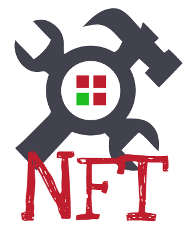
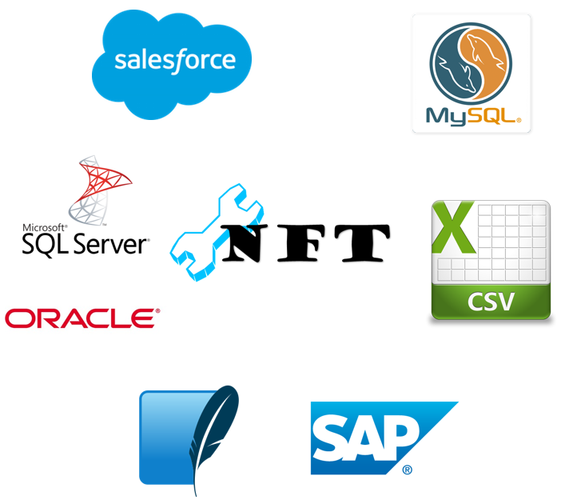

# NFT - no-frills-transformation



"No frills transformation" (NFT) is intended to be a lightweight transformation engine, having an extensible interface which makes it simple to

* [Extend with Source Readers](https://github.com/Haufe-Lexware/haufe.no-frills-transformation/wiki/Extending-with-Plugins)
* [Extend with Target Writers](https://github.com/Haufe-Lexware/haufe.no-frills-transformation/wiki/Extending-with-Plugins)
* [Extend with additional Operators](https://github.com/Haufe-Lexware/haufe.no-frills-transformation/wiki/Extending-with-Plugins) (if you can't do with the [Custom Operators](https://github.com/Haufe-Lexware/haufe.no-frills-transformation/wiki/Using-Custom-Operators))

Out of the box, NFT will read from

* [CSV files in any encoding](https://github.com/Haufe-Lexware/haufe.no-frills-transformation/wiki/CSV-Reader)
* [Salesforce SOQL queries](https://github.com/Haufe-Lexware/haufe.no-frills-transformation/wiki/Salesforce-Reader)
* [SQLite Databases](https://github.com/Haufe-Lexware/haufe.no-frills-transformation/wiki/SQLite-Reader)
* [MySql Databases](https://github.com/Haufe-Lexware/haufe.no-frills-transformation/wiki/MySql-Reader)
* [Oracle Databases](https://github.com/Haufe-Lexware/haufe.no-frills-transformation/wiki/Oracle-Reader)
* [SQL Server Databases](https://github.com/Haufe-Lexware/haufe.no-frills-transformation/wiki/SQL-Server-Reader)
* [From SAP RFCs if they have a TABLE as output value (limited support currently)](https://github.com/Haufe-Lexware/haufe.no-frills-transformation/wiki/SAP-Reader)

and write to

* [CSV files in any encoding](https://github.com/Haufe-Lexware/haufe.no-frills-transformation/wiki/CSV-Writer) (including with or without UTF-8 BOMs)
* [Salesforce Objects](https://github.com/Haufe-Lexware/haufe.no-frills-transformation/wiki/Salesforce-Writer) (including Upserts and using External IDs)
* [Oracle Databases](https://github.com/Haufe-Lexware/haufe.no-frills-transformation/wiki/Oracle-Writer)
* [Rudimentary XML files](https://github.com/Haufe-Lexware/haufe.no-frills-transformation/wiki/XML-Writer)

A special "transformation" filter is supported, which currently only has an implementation for

* [SAP RFC Transformations](https://github.com/Haufe-Lexware/haufe.no-frills-transformation/wiki/SAP-Transformer): Read the parameters from a source and pass them to the RFC and retrieve the results from that to the output

There may be more to come; and if you have special needs, feel free to reach out and we'll look together what we can do about it.



In an ETL scenario, NFT is not specifically designed to do the "E" nor the "L" part, mostly just "T" tasks. But that quickly and efficiently, supporting the basic transformation stuff you might need (and with extensibility support if you need something out of the order). For convenience, the "E" is supported better than "L", with e.g. a Salesforce Reader for SOQL queries.
 
Among supported transformations are:

* Copy (nop transformation, copy source to target) using the source field operator, e.g. `$FirstName`
* Lookup (in other sources), using the [lookup operator](https://github.com/Haufe-Lexware/haufe.no-frills-transformation/wiki/Lookup-Operator); see also [lookup definitions in the config file](https://github.com/Haufe-Lexware/haufe.no-frills-transformation/wiki/Config-File-Documentation#lookup)
* [Filtering](https://github.com/Haufe-Lexware/haufe.no-frills-transformation/wiki/Config-File-Documentation#filter) (on source data)

Feel free to contribute and create pull requests. I'll check them out and merge them if they make sense.

Head over to the [WIKI](https://github.com/Haufe-Lexware/haufe.no-frills-transformation/wiki) for an extensive documentation:

* https://github.com/Haufe-Lexware/haufe.no-frills-transformation/wiki

## Binary Downloads

Check out the [releases](https://github.com/Haufe-Lexware/haufe.no-frills-transformation/releases) section for binary packages of NFT.

See also the [installation guide](https://github.com/Haufe-Lexware/haufe.no-frills-transformation/wiki/Installation-Guide).

## Acknowledgements

NFT (the CSV plugin to be more precise) is using parts of the brilliant CSV reader library written by Sebastien Lorion. You can find the original project page at CodeProject:

http://www.codeproject.com/Articles/9258/A-Fast-CSV-Reader

NFT has pulled in the CSV parts in the source code directly. They can be found here:

https://github.com/Haufe-Lexware/haufe.no-frills-transformation/tree/master/src/3rdParty/LumenWorks.Framework.IO

## Configuration

The basic idea of NFT is that you configure the transformations using an XML file. The XML file contains
the following main parts:

* [A data source](https://github.com/Haufe-Lexware/haufe.no-frills-transformation/wiki/Config-File-Documentation#source)
* [Source filters](https://github.com/Haufe-Lexware/haufe.no-frills-transformation/wiki/Config-File-Documentation#filter)
* [A target](https://github.com/Haufe-Lexware/haufe.no-frills-transformation/wiki/Config-File-Documentation#target)
* [Lookup map definitions](https://github.com/Haufe-Lexware/haufe.no-frills-transformation/wiki/Config-File-Documentation#lookup)
* [Target field definitions](https://github.com/Haufe-Lexware/haufe.no-frills-transformation/wiki/Config-File-Documentation#mapping)

### Sample XML config file

A typical simple XML configuration may look like this:

```xml
<?xml version="1.0" encoding="utf-8"?>
<Transformation>
  <Logger type="file" level="info">C:\temp\log.txt</Logger>
  <Source config="delim=','">file://C:\temp\users.csv</Source>
  <Target config="delim=','">file://C:\temp\Accounts.csv</Target>
  <LookupMaps>
    <LookupMap keyField="id" name="Status">
      <Source config="delim=','">file://C:\temp\status_mapping.csv</Source>
    </LookupMap>
  </LookupMaps>

  <FilterMode>AND</FilterMode>
  <SourceFilters>
    <!-- In shorter, this is just Contains($SOBID, "A") -->
    <SourceFilter>Equals(If(Contains($SOBID, "A"), "hooray", "boo"), "HooRay")</SourceFilter>
  </SourceFilters>

  <Fields>
    <!-- The target row number -->
    <Field name="RowNo" maxSize="10">TargetRowNum()</Field>
    <!-- The source row number -->
    <Field name="SourceRowNo" maxSize="10">SourceRowNum()</Field>
    <!-- Plain copy of field content -->
    <Field name="SapUserId__c" maxSize="16">LowerCase($SOBID)</Field>
    <!-- Concatenation of two source fields -->
    <Field name="Whatever" maxSize="50">$OTYPE + $OBJID</Field>
    <!-- status mapping from lookup "Status" (see definition above) -->
    <Field name="Status" maxSize="40">Status($BOGUSTYPE, $salesforce_status)</Field>
  </Fields>

  <OperatorConfigs>
    <OperatorConfig name="equals">ignorecase</OperatorConfig>"
  </OperatorConfigs>
</Transformation>
```

So, what does this do?
* Defines log output to be written to a file (`log.txt`)
* Reads data from `C:\temp\users.csv`
* Writes data to `C:\temp\Accounts.csv`
* Loads a [lookup map](https://github.com/Haufe-Lexware/haufe.no-frills-transformation/wiki/Config-File-Documentation#lookup) into the operator `Status` from `C:\temp\status_mapping.csv`
* Sets the [filter](https://github.com/Haufe-Lexware/haufe.no-frills-transformation/wiki/Config-File-Documentation#filter) mode to `AND` (all filter criteria must be met)
* Specifies a filter by using an [expression](https://github.com/Haufe-Lexware/haufe.no-frills-transformation/wiki/Expression-Syntax) which evaluates to a boolean
* Specifies a [mapping](https://github.com/Haufe-Lexware/haufe.no-frills-transformation/wiki/Config-File-Documentation#mapping) with five output fields, each with a name, max size and an [expression](https://github.com/Haufe-Lexware/haufe.no-frills-transformation/wiki/Expression-Syntax)
* Passes on a configuration string to the [`Equals` operator](https://github.com/Haufe-Lexware/haufe.no-frills-transformation/wiki/Equals-Operator) to make it behave as [`EqualsIgnoreCase`](https://github.com/Haufe-Lexware/haufe.no-frills-transformation/wiki/Equals-Operator)

Please confer with the Wiki for a more detailed specification of the options:
* https://github.com/Haufe-Lexware/haufe.no-frills-transformation/wiki

All links on this page lead into the wiki.

See also:

* [Getting Started](https://github.com/Haufe-Lexware/haufe.no-frills-transformation/wiki/Getting-Started)
* [Config File Documentation](https://github.com/Haufe-Lexware/haufe.no-frills-transformation/wiki/Config-File-Documentation)

### Running the application

Just call the executable with the full path to the XML configuration file.

```
C:\Temp> NoFrillsTransformation.exe sample_config.xml
Operation completed successfully.
C:\Temp> 
```
If the operation completes without error, the executable with exit with the exit code 0 (Success). Otherwise, an error message will be output to `stderr` and the exit code unequal 0 (for now, 1).

##### Running on Mac OS X and Linux

If you want to run NFT on Mac OS X, you need the Mono framework, which is the .NET implementation for non-Windows platforms (such as Linux or Mac OS X).

Download and install Mono prior to running `NoFrillsTransformation.exe`, then proceed as follows:

```bash
$ mono NoFrillsTransformation.exe configFile.xml
Operation finished successfully.
$
```

Please note that some of the plugins are currently only available for the Windows platform, such as the Oracle plugin.